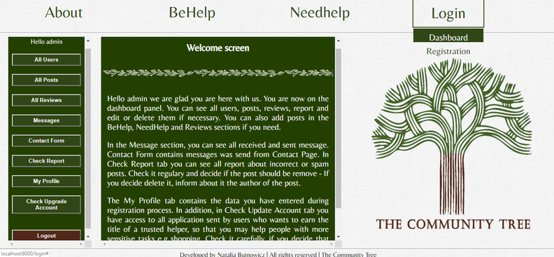

### Higher Diploma in Science in Web Technologies - Final Project 2019
### The Community Tree - web application

##### Used technologies: Node.js, MySQL, JSON, HTML, CSS, JavaScript, jQuery. 
##### Code editor: Visual Studio Code

